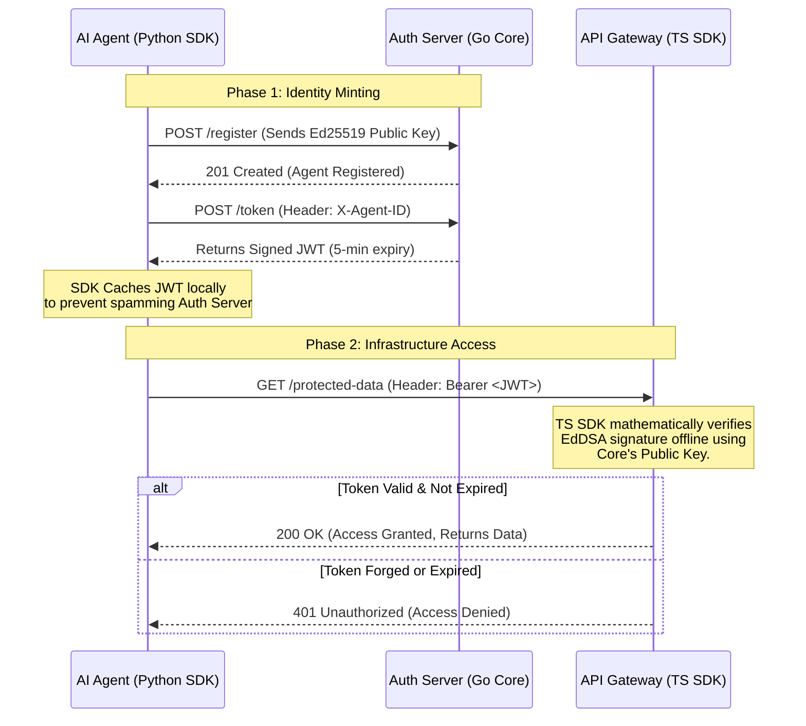

# 🛡️ Agent Auth Protocol

**The Identity and Access Management (IAM) layer for the Autonomous Economy.**

As we transition to an agentic economy, human OAuth flows (redirects, browser sessions, magic links) inherently fail for autonomous AI agents. The Agent Auth Protocol is a purely Machine-to-Machine (M2M), highly secure, low-latency authentication ecosystem built on Ed25519 cryptography.

We provide the foundational trust layer that allows AI agents to safely interact with Model Context Protocols (MCPs), edge infrastructure, and zero-trust networks.

## 🏗️ The Ecosystem

The protocol is split into three easily deployable components:

| Component                                                               | Role             | Distribution       | Description                                                                                                 |
| :---------------------------------------------------------------------- | :--------------- | :----------------- | :---------------------------------------------------------------------------------------------------------- |
| **[Core Server](https://github.com/agent-auth-protocol/core)**          | The Government   | `ghcr.io` (Docker) | A high-performance Go server that registers agent identities and issues short-lived JSON Web Tokens (JWTs). |
| **[Gateway Verifier](https://github.com/agent-auth-protocol/ts-sdk)**   | The Border Guard | `npm` (TypeScript) | Zero-dependency middleware for Next.js/Cloudflare to mathematically verify agent tokens offline.            |
| **[Agent Client](https://github.com/agent-auth-protocol/agentauth-py)** | The Traveler     | `pypi` (Python)    | The official SDK for LangChain/LlamaIndex agents to securely request and cache M2M tokens.                  |

## ⚡ Core Philosophy

1. **Zero-Human Intervention:** Designed strictly for M2M interactions. No passwords. No UI.
2. **Cryptographic Identity:** Agents are identified by Asymmetric Ed25519 keypairs, not fragile, easily leaked API keys.
3. **Ephemeral Access:** By default, agent JWTs expire in 5 minutes, significantly reducing the blast radius of a compromised agent.
4. **Offline Verification:** API Gateways verify signatures mathematically, meaning zero network latency and infinite horizontal scalability.

## 📖 How it Works

