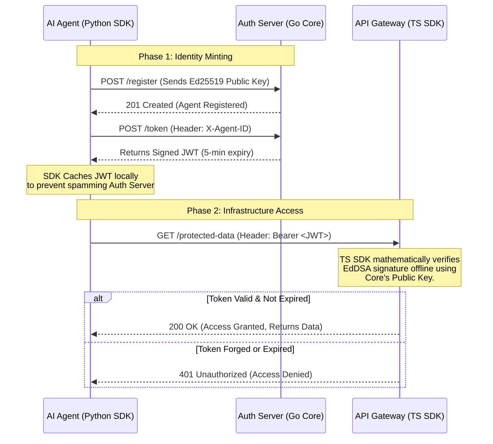

# 🛡️ Agent Auth Protocol

> **⚠️ ARCHIVED & PRIVATE:** This organization and its associated repositories have been archived and made private. All public packages (NPM, PyPI, GHCR Docker images) have been deprecated or fully deleted. The publishing pipelines have been dismantled, and this codebase is kept strictly for internal historical and architectural reference.

**The Identity and Access Management (IAM) layer for the Autonomous Economy.**

As we transition to an agentic economy, human OAuth flows (redirects, browser sessions, magic links) inherently fail for autonomous AI agents. The Agent Auth Protocol was designed as a purely Machine-to-Machine (M2M), highly secure, low-latency authentication ecosystem built on Ed25519 cryptography.

It provided the foundational trust layer that allowed AI agents to safely interact with Model Context Protocols (MCPs), edge infrastructure, and zero-trust networks.

## 🏗️ The Ecosystem

The protocol was split into three components (now private repositories):

| Component                                                               | Role             | Tech Stack       | Description                                                                                              |
| :---------------------------------------------------------------------- | :--------------- | :--------------- | :------------------------------------------------------------------------------------------------------- |
| **[Core Server](https://github.com/agent-auth-protocol/core)**          | The Government   | Go               | A high-performance server that registers agent identities and issues short-lived JSON Web Tokens (JWTs). |
| **[Gateway Verifier](https://github.com/agent-auth-protocol/ts-sdk)**   | The Border Guard | TypeScript       | Zero-dependency middleware for Node.js/Edge environments to mathematically verify agent tokens offline.  |
| **[Agent Client](https://github.com/agent-auth-protocol/agentauth-py)** | The Traveler     | Python           | The client SDK for LangChain/LlamaIndex agents to securely request and cache M2M tokens.                 |
| **[Interactive Demo](https://github.com/agent-auth-protocol/demo)**     | The Sandbox      | Streamlit / Node | A visual UI and code examples demonstrating the end-to-end cryptographic handshake.                      |

## ⚡ Core Philosophy

1. **Zero-Human Intervention:** Designed strictly for M2M interactions. No passwords. No UI.
2. **Cryptographic Identity:** Agents are identified by Asymmetric Ed25519 keypairs, not fragile, easily leaked API keys.
3. **Ephemeral Access:** By default, agent JWTs expire in 5 minutes, significantly reducing the blast radius of a compromised agent.
4. **Offline Verification:** API Gateways verify signatures mathematically, meaning zero network latency and infinite horizontal scalability.

## 📖 How it Works

